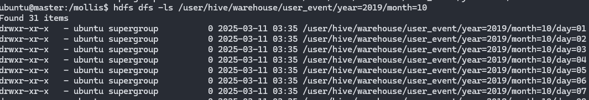
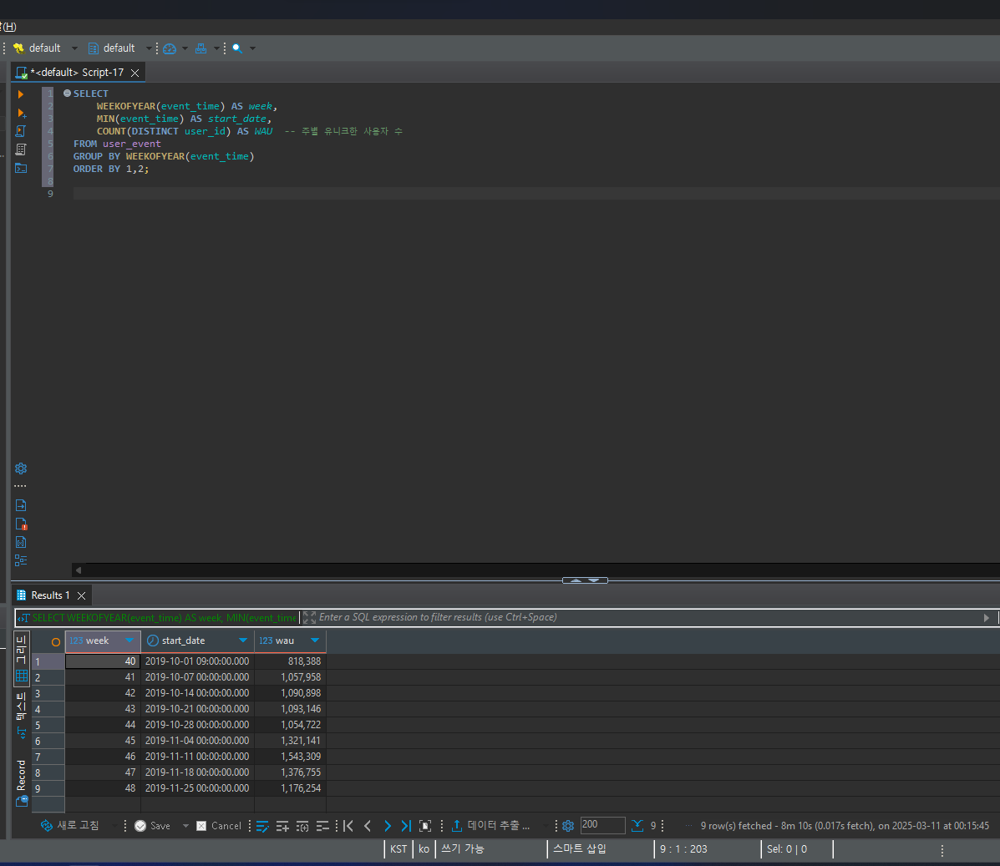
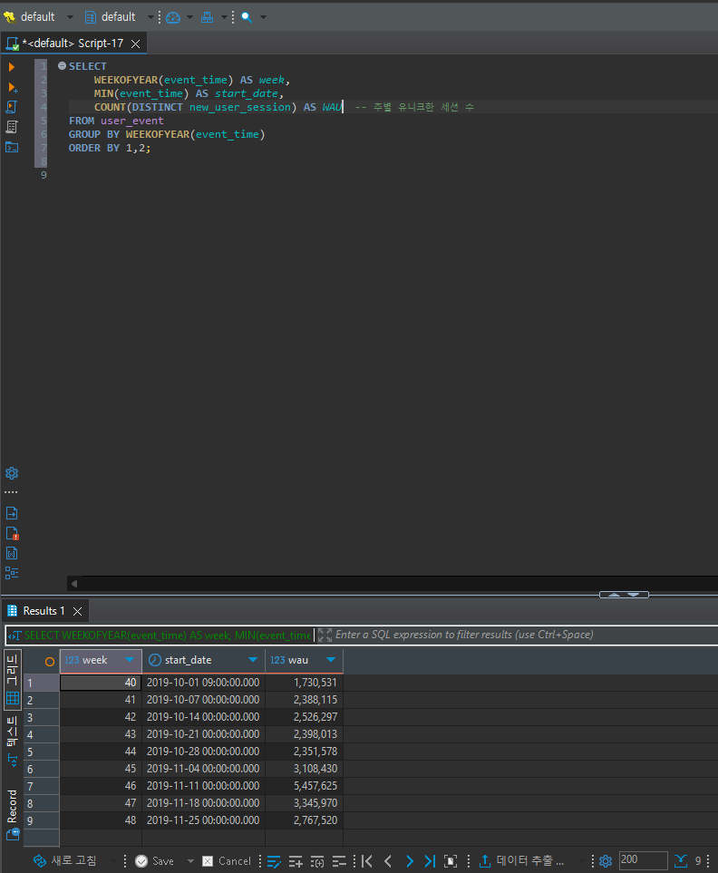

# User_Event_ETL

# 1. 개발환경
- 로컬 Docker로 Hadoop,Spark,Hive환경 구성
- 메타스토어 데이터베이스는 PostgreSQL사용

# 2. 테스트환경
1) 로컬 Docker 환경 내 Zeppelin
2) AWS EMR

# 3. 수행결과
1. KST기준 daily partition 처리
    - KST처리 : from_utc_timestamp() 활용
    - daily partition 처리 : 년-월-일 컬럼구성 후 파티션을 나누어 저장
    

2. 동일 user_id내에서 event_time 간격이 5분 이상인 경우 세션종료로 간주하고 새로운 세션 ID생성
    - window함수(lag)을 활용하여 이전시간과 비교
    - UDF를 활용해 새로운 세션아이디 생성

3. 재처리 후 parquet,snappy처리
    - 재처리한 데이터를 hdfs에 저장을 하면서 파티션처리와 포맷형식,압축옵션을 설정함
4. External Talbe방식으로 설계하고, 추가 기간 처리에 대응가능하도록 구현
    - spark세션 생성 시 enableHiveSupport()함수를 통해 hive와 연동 후,
    spark.sql()을 활용해 External테이블 생성
    - MSCK를 활용해 메타데이터 반영
5. 배치 장애시 복구를 위한 장치 구현
    - hdfs내에 체크포인트 위치 설정
    - 최종 Action수행 전 checkpoint수행
6. WAU 수행 (프로젝트 내 srs/main/resources/hql에 쿼리파일 존재)
    - user_id기준으로 WAU수행
    
    - new_user_session기준으로 WAU수행
    
---
# 4.  Scala 언어 선택 사유
1. Scala REPL(Interactive Read-Eval-Print Loop) 환경을 통해 빠르게 프로토타입을 개발하고, 인터렉티브한 디버깅이 가능하다.
2. Java에 비해 코드가 간결하다.

